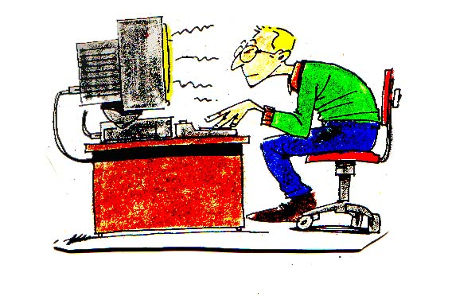

<section class="ergonomia-detallada">
    

        La ergonomía informática es la disciplina que busca adaptar el entorno de trabajo (hardware, mobiliario y software) a las capacidades y limitaciones físicas del usuario.
    

<h2 style="color: var(--accent-manuel);">1.Trastornos Musculoesqueléticos (TME)</h2>
    
En el sector profesional de la informatica, el principal problema no es el esfuerzo muscular intenso, sino la <strong>carga estática</strong>. Mantener la misma postura durante horas provoca una compresión constante de los vasos sanguíneos, dificultando el aporte de oxígeno y nutrientes al músculo.

    

        

            <h3 style="color: var(--accent-manuel); margin-top: 0;">Consecuencias a Corto Plazo</h3>
            <ul>
                <li>Pesadez muscular y entumecimiento.</li>
                <li>Contracturas en la zona del trapecio.</li>
                <li>Hormigueo en extremidades superiores.</li>
                <li>Cefaleas tensionales (dolor de cabeza por estrés físico).</li>
            </ul>
        

        

            <h3 style="color: var(--accent-manuel); margin-top: 0;">Patologías Crónicas</h3>
            <ul>
                <li><strong>Cifosis dorsal:</strong> Curvatura excesiva de la espalda "chepa".</li>
                <li><strong>Epicondilitis:</strong> Conocida como "codo de tenista" por el uso del ratón.</li>
                <li><strong>Hernias discales:</strong> Por presión desigual en los discos intervertebrales.</li>
            </ul>
        

    

<h2 style="color: var(--accent-manuel);">2. El Síndrome Visual Informático (SVI) a Fondo</h2>
    
No se trata solo de cansancio. El SVI es un conjunto de problemas relacionados con la visión que afectan al 90% de las personas que pasan más de 3 horas frente a un monitor. Los factores críticos son:

    
<ul>
        <li><strong>El Brillo y Contraste:</strong> Un exceso de brillo provoca deslumbramiento, mientras que un contraste bajo obliga al ojo a forzar el enfoque (acomodación).</li>
        <li><strong>Luz Azul:</strong> La longitud de onda corta emitida por pantallas LED puede alterar los ciclos de sueño (ritmos circadianos) al inhibir la melatonina.</li>
    </ul>

        
        
La iluminación debe ser cenital o lateral, evitando reflejos directos sobre la superficie de la pantalla.

    

    

            <h3 style="color: var(--accent-manuel); margin-top: 0;">Consecuencias a Corto Plazo</h3>
            <ul>
                <li><strong>Acomodación excesiva:</strong> El músculo ciliar del ojo está en constante tensión para enfocar de cerca, lo que genera dolores de cabeza.</li>
                <li><strong>Sequedad ocular:</strong> Al mirar una pantalla, reducimos la frecuencia de parpadeo de 20 a unas 5-7 veces por minuto, impidiendo la lubricación natural del ojo.</li>
                <li><strong>Deslumbramiento:</strong> Los reflejos de ventanas o luces mal situadas fuerzan la vista y provocan fatiga prematura.</li>
            </ul>
        

    <h2 style="color: var(--accent-manuel);">3.Factores de Riesgo Ambientales y Organizativos</h2>
    
Muchas veces nos centramos solo en la silla, pero el entorno físico y la organización del tiempo son determinantes para evitar la fatiga crónica. Estos factores suelen ser ignorados, pero impactan directamente en la salud ergonómica del informático:

    <table style="width: 100%; border-collapse: collapse; background: rgba(30, 41, 59, 0.3); border-radius: 12px; overflow: hidden;">
        <thead>
            <tr style="background-color: rgba(56, 189, 248, 0.2); color: var(--accent-manuel);">
                <th style="padding: 15px; text-align: left; border-bottom: 2px solid var(--accent-manuel);">Factor</th>
                <th style="padding: 15px; text-align: left; border-bottom: 2px solid var(--accent-manuel);">Riesgo Ergonómico</th>
                <th style="padding: 15px; text-align: left; border-bottom: 2px solid var(--accent-manuel);">Solución Ideal / Prevención</th>
            </tr>
        </thead>
        <tbody>
            <tr>
                <td style="padding: 15px; border-bottom: 1px solid rgba(255,255,255,0.05);"><strong>Iluminación</strong></td>
                <td style="padding: 15px; border-bottom: 1px solid rgba(255,255,255,0.05);">Brillos en pantalla, deslumbramientos y sombras que fuerzan posturas raras de cuello para poder leer.</td>
                <td style="padding: 15px; border-bottom: 1px solid rgba(255,255,255,0.05);">Uso de luz natural lateral respecto a la pantalla. Evitar fluorescentes directos y usar filtros antirreflejantes.</td>
            </tr>
            <tr style="background: rgba(255,255,255,0.02);">
                <td style="padding: 15px; border-bottom: 1px solid rgba(255,255,255,0.05);"><strong>Temperatura</strong></td>
                <td style="padding: 15px; border-bottom: 1px solid rgba(255,255,255,0.05);">El frío excesivo provoca rigidez muscular y contracturas; el calor reduce la concentración y causa somnolencia.</td>
                <td style="padding: 15px; border-bottom: 1px solid rgba(255,255,255,0.05);">Mantener una temperatura operativa estable entre <strong>20°C y 24°C</strong> con una humedad relativa del 45-60%.</td>
            </tr>
            <tr>
                <td style="padding: 15px; border-bottom: 1px solid rgba(255,255,255,0.05);"><strong>Sedentarismo</strong></td>
                <td style="padding: 15px; border-bottom: 1px solid rgba(255,255,255,0.05);">Problemas circulatorios, síndrome de piernas cansadas y debilitamiento de la musculatura del "core".</td>
                <td style="padding: 15px; border-bottom: 1px solid rgba(255,255,255,0.05);">Implementar <strong>pausas activas</strong> cada 60 min, uso de reposapiés y, si es posible, alternar con escritorios regulables.</td>
            </tr>
            <tr style="background: rgba(255,255,255,0.02);">
                <td style="padding: 15px; border-bottom: 1px solid rgba(255,255,255,0.05);"><strong>Ruido</strong></td>
                <td style="padding: 15px; border-bottom: 1px solid rgba(255,255,255,0.05);">Niveles superiores a 55 dB en oficinas provocan estrés, aumento de la tensión arterial y fatiga mental.</td>
                <td style="padding: 15px; border-bottom: 1px solid rgba(255,255,255,0.05);">Acondicionamiento acústico o uso de auriculares con cancelación de ruido en entornos de Open Office.</td>
            </tr>
        </tbody>
    </table>
    

    

        <strong style="color: var(--accent-sergio);">Nota Importante:</strong> El confort ambiental no es un lujo, es una necesidad preventiva. Un entorno mal iluminado o ruidoso acaba derivando en posturas forzadas de compensación que dañan tu columna a largo plazo.
    

    

<h2 style="color: var(--accent-manuel);">5. Normativa Aplicable (España)</h2>
    
Es importante saber que la salud laboral está protegida por ley. El <strong>Real Decreto 488/1997</strong> establece las disposiciones mínimas de seguridad y salud relativas al trabajo con equipos que incluyen pantallas de visualización.

    <blockquote>
        "El empresario tiene la obligación de evaluar los riesgos y proporcionar formación a los trabajadores sobre cómo configurar su puesto y realizar descansos periódicos."
    </blockquote>

        
    

    

    <a href="index.html" class="nav-link">🏠 Volver al Inicio</a>
    <a href="rpsicosociales.html" class="nav-link">Riesgos psicosociales ➜</a>

</section>

